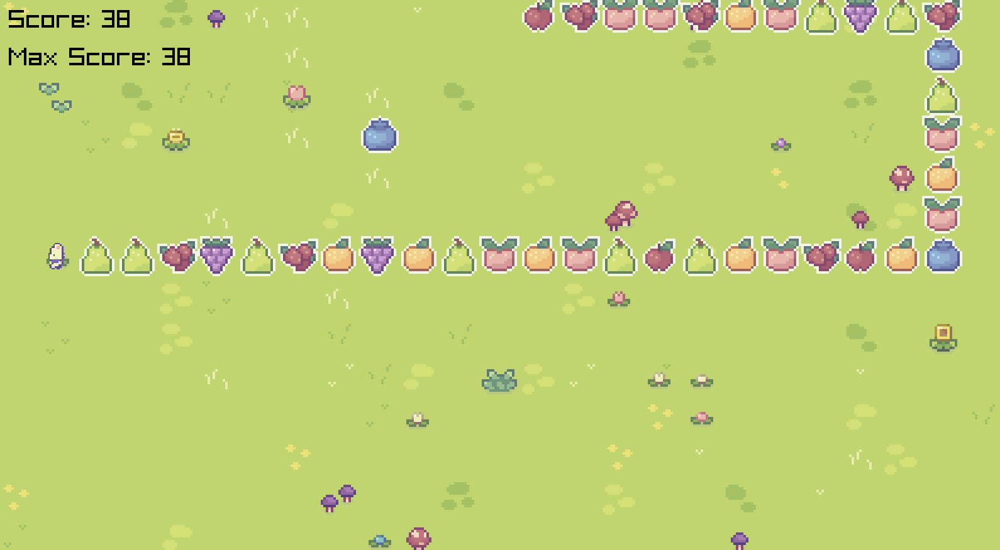

# Bunny Fruit (sorry I am not that creative with names)

(sorry not too great at taking screenshots either)

# Compile Instructions:
Using Cmake:

    1) mkdir build && cd build
    2) cmake ..
    3) cmake --build .
    4) ./bunny-fruit